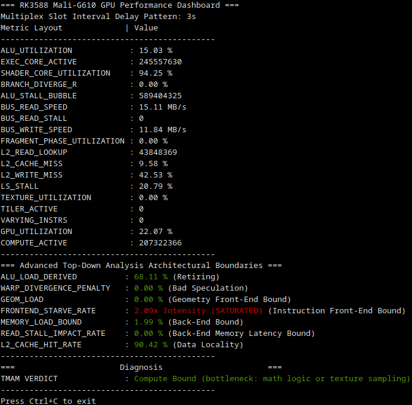

# Mali-G610 Performance Monitor for RK3588

[](https://doi.org/10.5281/zenodo.21396388)

A lightweight, high-performance C++ command-line utility designed to monitor internal hardware counters of the **Arm Mali-G610 GPU** on **Rockchip RK3588/RK3588S** SoCs.

This application uses the modern **libGPUCounters (v2.4.0) [ex-HWCPipe]** API to implement an advanced Top-Down style microarchitectural analysis tailored to mobile GPU topologies.

<p align="center">
  
</p>

---

## Key Features

* **Explicit Slot Multiplexing**: Manually groups queries into 5 explicitly defined, sequentially rotated hardware bundles. This forces co-dependent metrics into the same physical sampling window and prevents register conflicts common to the Valhall v3 CSF architecture.
* **Multi-Core Pipeline Normalization**: Factors in a structural normalization divisor (accounting for the 4-core multi-pipeline topology) to anchor the absolute execution engine starvation rate.
* **Transient Outlier Filtering**: Implements a time-locked historical cache to verify memory bandwidth counter increments across multiplex cycles.
* **Precise Clock Synchronization**: Latches delta timestamps immediately via `std::chrono::steady_clock` to mitigate thread-sleep scheduling jitter.

---

## System Requirements & Prerequisites

### 1. Hardware
* Rockchip RK3588 or RK3588S SoC (e.g., Orange Pi 5, Radxa Rock 5B, Indiedroid Nova, Khadas Edge2).

### 2. Software & Libraries
* Linux kernel running the proprietary Arm Mali kernel-space driver (`mali_kbase`).
* Installed [`libGPUCounters`](https://github.com/ARM-software/libGPUCounters) (v2.4.0 or newer) headers and linked shared libraries.
* GCC/G++ supporting C++17 or higher.

### 3. Driver Permissions (Critical)
By default, the Linux kernel restricts raw performance event queries for unprivileged users. Run this on your target board to allow counter sampling:
```bash
sudo sysctl -w kernel.perf_event_paranoid=1
```

---

## Compilation & Execution

Build the application using `g++`, ensuring you explicitly link `libhwcpipe`, `libdevice`, and `libpthread`:

```bash
make
```

### Running the Monitor
Run the application with `sudo` to ensure unobstructed access to the GPU hardware device nodes. You can optionally pass an integer argument to define the slot interval delay in seconds (defaults to `1`):

```bash
# Run with a 1-second refresh rate
sudo ./valkyrja

# Run with a 3-second refresh rate
sudo ./valkyrja 3
```

---

## Architectural Bounds Analysis (Top-Down Method)

Traditional CPU metrics like Branch Misprediction and Intel-style TMAM bounds do not map directly to GPU topologies due to hardware latency hiding and thread-group lockstep warps. This monitor translates Mali metrics into logical architectural equivalents:

                                                       [ GPU_UTILIZATION (Top-Level Job Activity) ]
                                              /                              |                              \
                          [ PIXEL_ACTIVE (3D Graphics) ]           [ GEOM_LOAD (Tiler) ]          [ COMPUTE_ACTIVE (Compute/ML) ]
                                             |                  ([L1] Front-End Tiler Bound)                 |
                                              \                              |                              /
                                               `-----------------------------+-----------------------------'
                                                                             |
                                                          [ EXEC_CORE_ACTIVE (Shader Execution) ]
                                                                             |
                                     ----------------------------------------+----------------------------------------
                                   /                                         |                                        \
                      [ FRONTEND_STARVE_RATE ]                      [ ALU_UTILIZATION ]                    [ LS_STALL / VARYING_INSTRS ]
                   ([L1] Front-End Bound (Instr))                     /             \                                  |
                                                                     /               \                                 |
                                                     [ ALU_LOAD_DERIVED ]        [ WARP_DIVERGENCE_PENALTY ]     [ MEMORY_LOAD_BOUND ]
                                                         (Retiring)                  (Bad Speculation)           ([L1] Back-End Bound)
                                                                                                                       |
                                                                                                                       ---------------- [ BUS_READ_STALL ]
                                                                                                                                    ([L2] Latency/DRAM Bound)
                                                                                                                                                  |
                                                                                                                                                  ---------------- [ L2_CACHE_HIT_RATE ]
                                                                                                                                                             ([L3] Hit Bound / Data Locality)

### Advanced Top-Down Metrics

#### 1. `ALU_LOAD_DERIVED` (Retiring)
* **Formula**: `(ALU_UTILIZATION / GPU_UTILIZATION) * 100`
* **Interpretation**: Isolates math operational density from idle clock ticks. If `ALU_UTILIZATION` is high but `GPU_UTILIZATION` is low, the workload runs demanding code in short bursts. If both metrics spike together, the pipeline is intensely math-bound.

#### 2. `WARP_DIVERGENCE_PENALTY` (Bad Speculation)
* **Formula**: `ALU_UTILIZATION * (BRANCH_DIVERGE_R / 100.0)`
* **Interpretation**: Quantifies the true microarchitectural performance damage caused by control-flow branch splitting. It measures the absolute percentage of overall GPU capacity lost to processing masked (disabled) vector execution lanes. High values mean that the arithmetic ports are congested with dead instruction paths, indicating a critical need to flatten if/else shader logic into non-divergent ternary math hardware operations (clamp, mix, select).

#### 3. `GEOM_LOAD` (Front-End Bound -> Fixed-Function Geometry Starvation)
* **Formula**: `(TILER_ACTIVE / EXEC_CORE_ACTIVE) * 100.0`
* **Interpretation**: Tracks the utilization of the fixed-function primitive assembly and sorting hardware blocks relative to base clock execution. High workloads (>75%) coupled with a low pixel shading footprint pinpoint geometric asset bottlenecks (e.g., lack of mesh Level-of-Detail models, missing camera frustum culling, or high micro-triangle densities causing tiler thrashing).

#### 4. `FRONTEND_STARVE_RATE` (Front-End Bound -> Instruction Delivery Starvation)
* **Formula**: `(ALU_STALL_BUBBLE / EXEC_CORE_ACTIVE)`
* **Interpretation**: Measures the ratio of active core runtime where execution lanes sat completely idle because instructions were unavailable. On multi-core Valhall v3 configurations (like the Mali-G610), raw pipeline event accumulators count across multiple internal parallel pipelines simultaneously. If parallel stalling events exceed baseline active clock ticks, the application dynamically reformats the percentage output into an **Intensity Saturation Coefficient Factor** (e.g., `2.12x Intensity (SATURATED)`). This coefficient acts as a direct multiplier tracking instruction-delivery bottlenecks—meaning a `2.12x` factor implies that arithmetic units encounter an average of 2.12 structural starvation bubbles for every single active core clock cycle.

#### 5. `MEMORY_LOAD_BOUND` (Back-End Bound)
* **Formula**: `LS_STALL * (L2_CACHE_MISS / 100.0)`
* **Interpretation**: Evaluates severe memory engine constraints by weighing overall Load/Store execution stalls against L2 cache miss rates. High boundaries indicate that the execution core is choked waiting for external main system RAM.

#### 6. `READ_STALL_IMPACT_RATE` (Back-End Memory Latency Bound)
* **Formula**: `(BUS_READ_STALL / EXEC_CORE_ACTIVE) * 100.0`
* **Interpretation**: Measures the absolute cycle penalty where the GPU's internal L2 cache interface sits entirely frozen waiting on the external RK3588 memory controller to return data. A rate exceeding 20% identifies a severe system RAM bandwidth or latency bottleneck, requiring immediate texture compression (ASTC/ETC2) or better temporal data locality.

#### 7. `L2_CACHE_HIT_RATE` (Efficiency Tracker)
* **Formula**: `100.0 - L2_CACHE_MISS`
* **Interpretation**: Highlights data locality. Healthy pipelines maintain a hit rate `>85%`. Lower numbers imply poor memory access indexing patterns within custom OpenCL, Vulkan Compute, or ML inference shaders.

---

### Raw Counter Diagnostic Guide

* **`ALU_UTILIZATION`**: The raw workload density passing through the arithmetic processing pipelines.
* **`GPU_UTILIZATION`**: General frontend job manager availability indicator.
* **`SHADER_CORE_UTILIZATION`**: The baseline execution clock tracking core population status. Indicates whether at least one active execution thread group (warp) is resident in the programmable core slices.
* **`PIXEL_ACTIVE`**: Active cycles inside fragment/pixel paths. Indicates traditional 3D rendering overhead.
* **`COMPUTE_ACTIVE`**: Compute queue transaction metrics. Tracks ML layer executions (OpenCL/Vulkan Compute) and geometric matrices.
* **`BRANCH_DIVERGE_R`**: Tracks the occurrence of branch divergence within 16-thread hardware warps. Higher rates trigger lane-masking overhead, forcing the GPU to execute both conditional paths sequentially instead of concurrently.
* **`BUS_READ_SPEED` / `BUS_WRITE_SPEED`**: Corrected instantaneous external main memory interface throughput formatted cleanly in **MB/s**. Use this to cross-reference system bandwidth bottlenecks on the shared RK3588 memory bus.
* **`BUS_READ_STALL`**: Raw cycle register tracking how long the GPU's memory subsystem sat stalled waiting for external main memory read transactions to resolve.
* **`TEXTURE_UTILIZATION`**: Tracks the saturation of the hardware texturing units (T-Unit) performing bilinear/trilinear filtering, texture fetches, or image reads/writes.
* **`TILER_ACTIVE`**: Absolute hardware cycle counter for the fixed-function geometry tiler block, capturing primitive binning, viewport clipping, and tile list generation.
* **`VARYING_INSTRS`**: Total vector attribute/interpolator actions. **Note:** This metric safely reads `0` during OpenCL, machine learning, or pure compute tasks since compute threads entirely bypass traditional graphics primitive rasterization hardware units.
* **`COMPUTE_ACTIVE`**: Compute queue transaction metrics. Tracks Compute/ML layer executions (OpenCL/Vulkan Compute) and geometric matrices.

---

## Limitations & Troubleshooting

* **Initial Gathering Delay**: Due to the 5-way multiplex rotating loop layout, the metrics cache requires a baseline window of 5 sampling epochs (approx. 5–15 seconds depending on your chosen interval pass parameter) to initially gather, validate, and smooth out its differential throughput calculations.
* **Permissions Denied Error**: If the profile fails to initialize, verify you are launching with `sudo` and check that `kernel.perf_event_paranoid` has been set to `1`.
